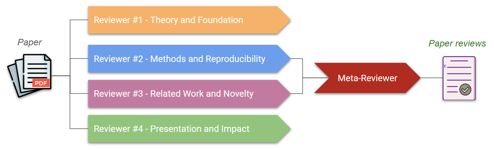
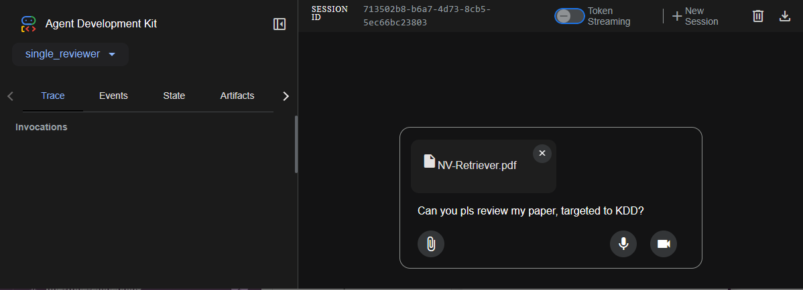
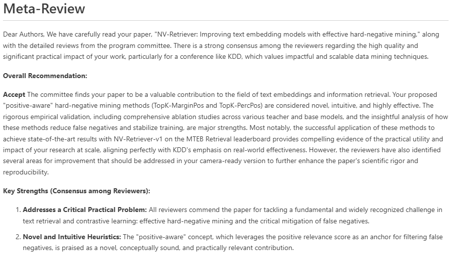

# Agentic Paper Reviewer system with ADK

This repo demonstrates how to use ADK for creating a simple agentic system that emulates paper review process by an academic conference Program Commitee. The code demonstrates ADK workflow agents - `SequentialAgent` and `ParallelAgent` - which are useful to create deterministic pipelines. The agents are powered by Google Gemini API.


This is the workflow:



1. User messages the system with the desired conference to submit a paper and attach a paper PDF.
2. Each reviewer agent, configured to have a different profile/emphasis, perform an independent review of the paper in parallel.
3. The meta-reviewer agent reads all the reviews, summarizes the major strengths / weaknesses of the paper and provides the final decision on acceptance/rejection.

The full description of this project can be found in this [blog post](https://gspmoreira.medium.com/building-an-agentic-system-with-adk-and-gemini-to-simulate-a-paper-review-committee-eabad29f6172).

## Installing
```bash
# Clone the repo
git clone https://github.com/gabrielspmoreira/agentic_paper_review_adk.git
cd agentic_paper_review_adk/
# Creating a virtual environment and install the dependencies
python3 -m venv .venv/agentic_paper_review
source .venv/agentic_paper_review/bin/activate
pip install -r requirements.txt
```

## Starting ADK Web UI
1. Start the ADK Web UI with the following command. The URL of ADK Web UI will be printed by the command.  

```bash
adk web agents/
```

P.s. If you are using Google Cloud Shell, click in the *Web Preview* button at top right of Cloud Shell and click in *Change Port* if needed (e.g. 8000) and then click in *Preview on port 8000*.  

2. When the browser loads, the ADK Web UI webapp will be presented.  
3. Select in the top-left of the webapp one of the available agents: `single_reviewer`, `review_commitee`.  
4. On the right panel, type *I would like to submit this paper to KDD*, click in the attachment button to attach a paper PDF and press enter to  submit. After some seconds/minutes, the reviews and meta-review will be generated.

*Note*: If the agent answer is not shown in the chat panel, select the `State` tab in the top-left, and you will be able to see the answer under the `review` state (`output_key` set for the agent). 

5. If you want reviews and meta-review to be in a standard schema format, set `OUTPUT_JSON=True`, and it will set the `output_schema` argument from `LlmAgent` constructor.         

## Examples of reviews
In the folder [review_examples](review_examples/) you can find examples of reviews and meta-reviews for a [paper](https://arxiv.org/pdf/2407.15831) I co-authored with my colleagues at Nvidia.

Here some example of part of a meta-review.

